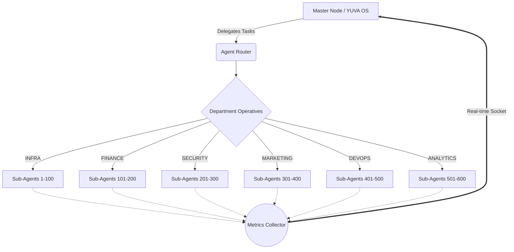

<div align="center">
  
  
  
  
  
  <br />
  <br />
  
  <h1 align="center">YUVA OS // AI Agent Manager</h1>
  
  <p align="center">
    <strong>A next-generation, 3D holographic command center for managing massive swarms of autonomous AI agents.</strong>
  </p>
</div>

<br />

## 🪐 Overview

**YUVA OS** is a cutting-edge, high-performance web dashboard engineered to visualize, manage, and track hundreds of AI sub-agents in real-time. Designed with a stunning 3D glassmorphic aesthetic and a cyberpunk-inspired UI, this dashboard brings your infrastructure to life.

Whether you're managing background queues, tracking resource allocation (CPU/Memory), or monitoring active network topologies, YUVA OS provides deep analytical insights wrapped in an immersive user experience.

---

## ⚡ Key Features

- 🌌 **Immersive 3D UI:** Built with Framer Motion and complex CSS perspective transforms to create floating, holographic glass panels.
- 📊 **Real-Time Analytics:** Powered by `Recharts` for live, glowing data visualization (Area, Bar, Line, and Pie charts).
- 🕸️ **Live Network Topology:** Custom-built SVG network maps that animate orbiting nodes representing active agents.
- 👨‍💻 **Matrix-Style Terminal:** A dedicated live logs page featuring CRT scanline effects and auto-scrolling execution logs.
- 🗄️ **Massive Registry:** A high-performance, filterable datagrid capable of rendering and managing 600+ AI agents simultaneously.

---

## 🏗️ Architecture



---

## 💻 Tech Stack

- **Framework:** React 18
- **Build Tool:** Vite 5
- **Styling:** Tailwind CSS v4 (with custom 3D utilities)
- **Routing:** React Router v6
- **Animations:** Framer Motion
- **Data Visualization:** Recharts
- **Icons:** Lucide React

---

## 🚀 Getting Started

### Prerequisites

Ensure you have [Node.js](https://nodejs.org/) installed on your machine (v18+ recommended).

### Installation

1. **Clone the repository:**
   ```bash
   git clone https://github.com/pukhrajsharmapukhrajsharma392-ai/ai-agent-manager.git
   cd ai-agent-manager
   ```

2. **Install dependencies:**
   ```bash
   npm install
   ```

3. **Start the development server:**
   ```bash
   npm run dev
   ```

4. **Open the application:**
   Navigate to `http://localhost:5173` in your browser.

---

## 🗺️ Module Breakdown

| Module | Description | Path |
| --- | --- | --- |
| **Overview** | The main dashboard featuring global load metrics, active nodes, and top-level operator statuses. | `/` |
| **Registry** | A comprehensive list of 600 detailed agents, complete with live CPU/Memory stats and text/status filtering. | `/agents` |
| **Topology** | Visual map of the internal network, displaying standard and critical nodes orbiting the Core AI. | `/network` |
| **Logs** | A fullscreen, CRT-styled streaming terminal tracking live process executions and system errors. | `/logs` |
| **Analytics** | Heavy data-visualization suite detailing exact resource distribution across departments. | `/analytics` |

---

## 🚀 Deployment

This project is fully optimized for deployment on Vercel.

1. Install the Vercel CLI:
   ```bash
   npm i -g vercel
   ```
2. Deploy:
   ```bash
   vercel --prod
   ```

---

## 📜 License

Distributed under the MIT License. See `LICENSE` for more information.

---

<div align="center">
  <p>Engineered with ❤️ for the future of Autonomous Agents.</p>
</div>
